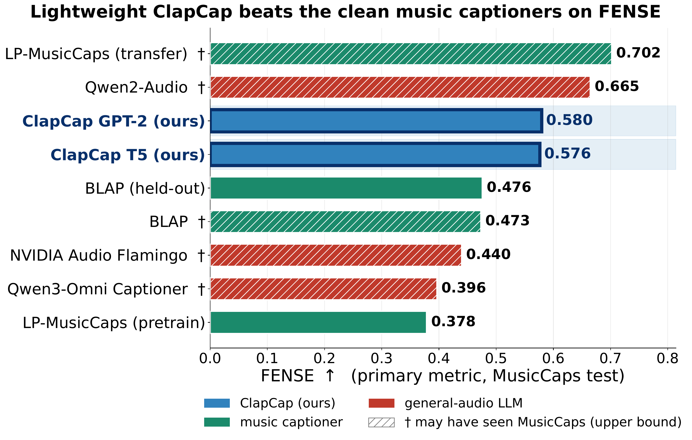
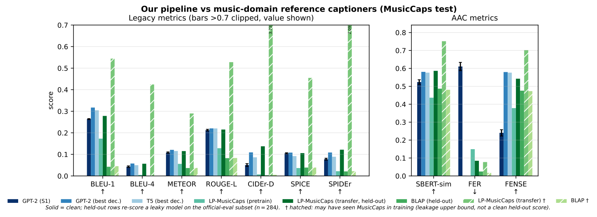
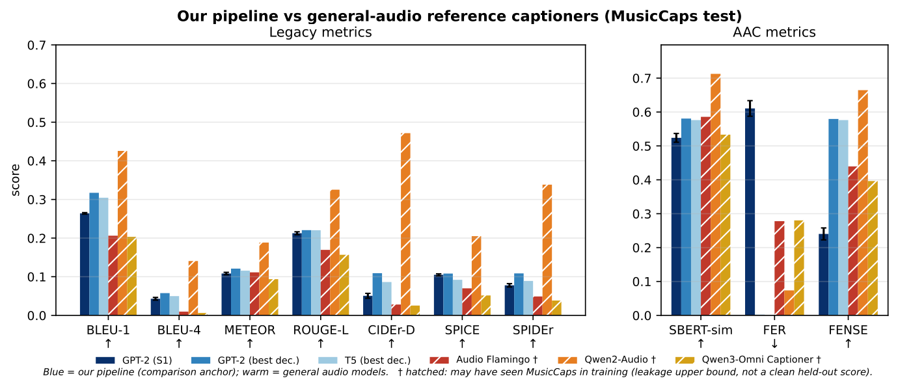
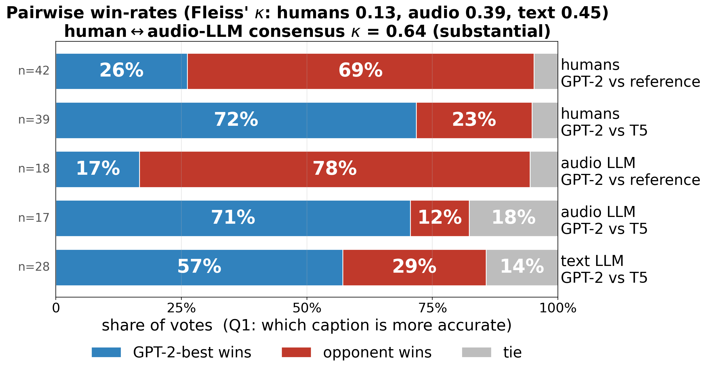
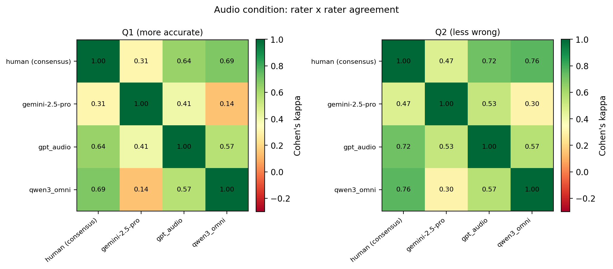
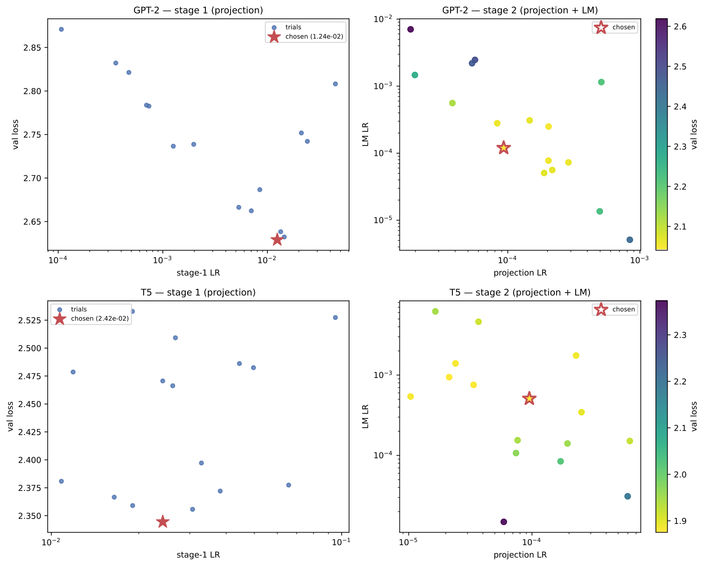
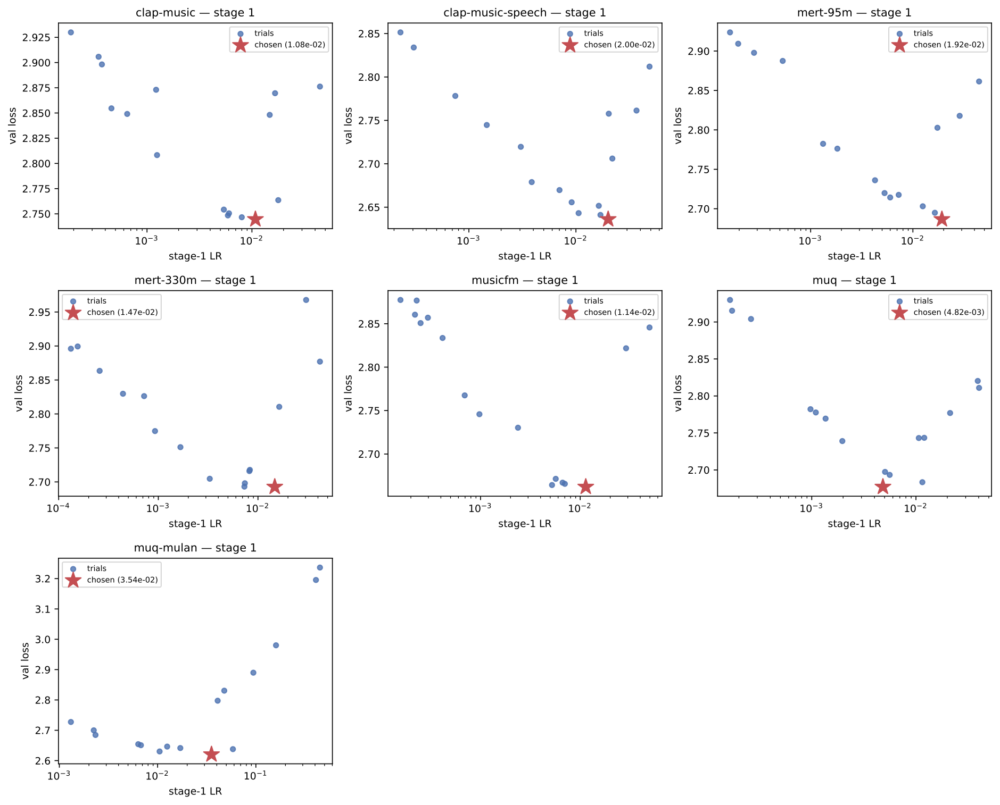
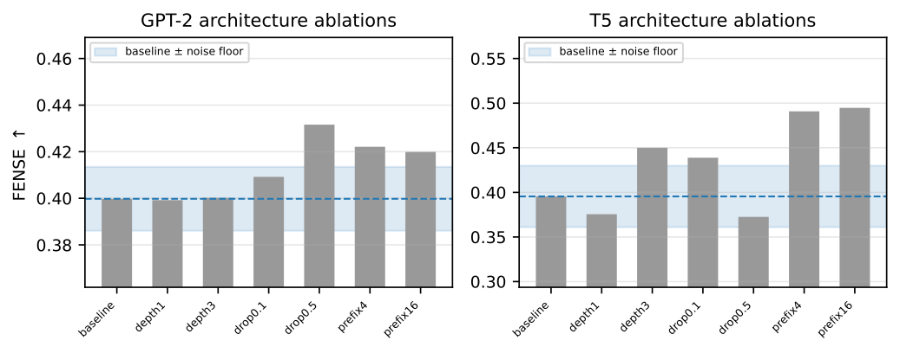
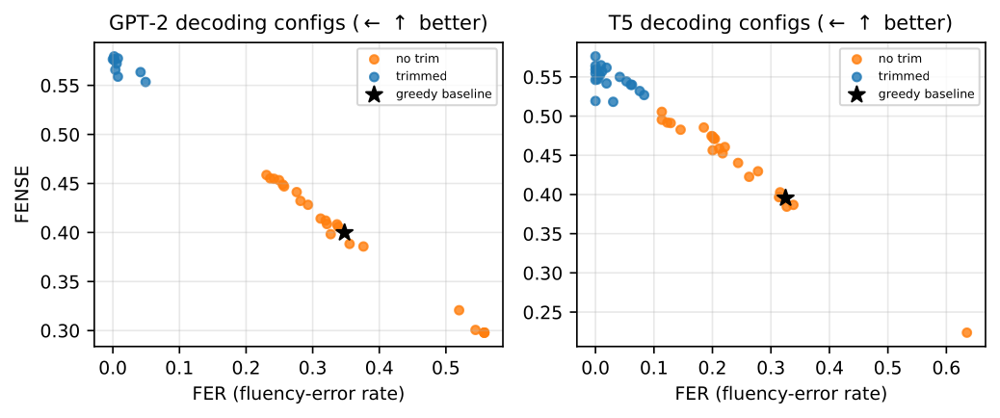
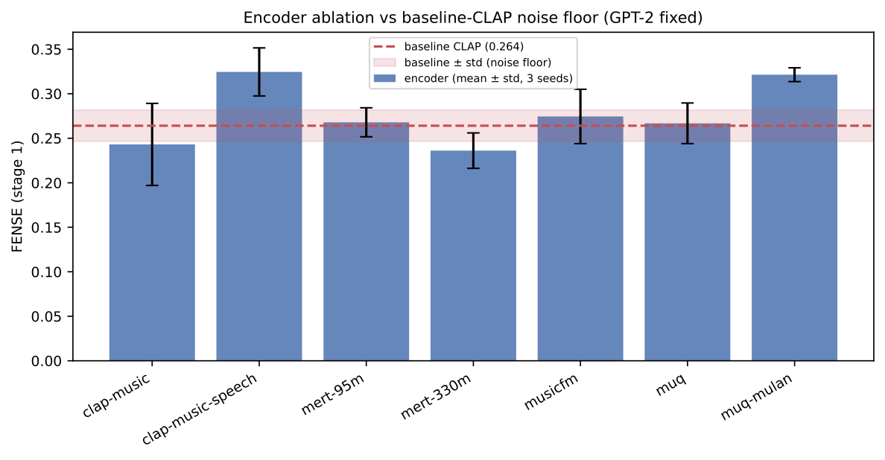

# Audio Captioning: Ablation Study

Systematic ablations for CLAP-based music captioning on MusicCaps, along two axes:

- **Language model** — GPT-2 vs T5-base, with a fixed audio encoder.
- **Audio encoder** — general CLAP vs music-specialized encoders, with a fixed
  language model (GPT-2).

The architecture is the audio analogue of ClipCap: a frozen audio encoder, a learned
MLP projection to a prefix of pseudo-tokens, and a language-model decoder. Training is
two-stage: (1) projection only (frozen LM), (2) projection + LM fine-tuning.



## Language Models

| Model | Type | Parameters |
|-------|------|-----------|
| GPT-2 | Decoder-only | 124M |
| T5-base | Encoder-decoder | 220M |

> OPT-350M and LLaMA-3.2-1B were explored earlier as additional decoder-only models.
> Their training scripts (`train_opt.py`, `train_llama.py`) and configs (`opt.yaml`,
> `llama.yaml`) remain in the repo but are **out of the current scope**.

## Audio Encoders

The encoder ablation fixes the language model (GPT-2) and swaps the frozen audio
encoder. The general-audio CLAP is the baseline; the music-specialized encoders are
the comparison rows. Embeddings are precomputed once per encoder; the projection input
dim auto-derives, so the rest of the pipeline is unchanged.

| `--encoder` | HF repo | Type | Dim | SR |
|-------------|---------|------|-----|----|
| `clap` | `laion/clap-htsat-unfused` | General audio (baseline) | 512 | 48k |
| `clap-music` | `laion/larger_clap_music` | Music CLAP | 512 | 48k |
| `clap-music-speech` | `laion/larger_clap_music_and_speech` | Music+speech CLAP | 512 | 48k |
| `mert-95m` | `m-a-p/MERT-v1-95M` | Music SSL (frame-level) | 768 | 24k |
| `mert-330m` | `m-a-p/MERT-v1-330M` | Music SSL (frame-level) | 1024 | 24k |
| `musicfm` | `minzwon/MusicFM` | BEST-RQ conformer (frame-level) | 1024 | 24k |
| `muq` | `OpenMuQ/MuQ-large-msd-iter` | Music SSL (frame-level) | 1024 | 24k |
| `muq-mulan` | `OpenMuQ/MuQ-MuLan-large` | Joint audio-text (pooled) | 512 | 24k |

Pooled encoders (`clap`, `muq-mulan`) return a clip vector directly; frame-level
encoders are mean-pooled over time. The encoder comparison reports **stage-1
(frozen-LM)** numbers, since stage-2 full fine-tuning tends to flatten upstream
differences.

## Reference Captioners

Off-the-shelf captioners that caption raw audio directly, bypassing the
CLAP→projection→LM pipeline. They are scored on the **same test split and the same
metrics** as a separate reference comparison (not as controlled ablation rows), to
contextualize the lightweight pipeline. Two groups.

**General zero-shot audio-LMs** (large, not music-specialized):

| Model | HF repo / slug | Backend | Input |
|-------|----------------|---------|-------|
| Audio Flamingo | `nvidia/audio-flamingo-next-captioner-hf` | `flamingo` | 16 kHz wav path (local) |
| Qwen2-Audio | `Qwen/Qwen2-Audio-7B-Instruct` | `qwen` | 16 kHz array (local) |
| Qwen3-Omni Captioner | `qwen3-omni-30b-a3b-captioner` | `dashscope` | base64 WAV via DashScope API |

The first two run locally (BF16 on GPU). The 30B Qwen3-Omni captioner is too large to
run locally, so the `dashscope` backend calls the DashScope OpenAI-compatible API
(`openai` SDK + base URL); set `DASHSCOPE_API_KEY` in `.env` (auto-loaded), and
`DASHSCOPE_BASE_URL` only for non-Singapore regions.

**Music-domain captioners** (trained specifically for music captioning):

| Model | Source | Runner | Notes |
|-------|--------|--------|-------|
| LP-MusicCaps (pretrain) | `seungheondoh/lp-music-caps` `pretrain.pth` | `lp_musiccaps_generate.py` | BART-base; MSD pseudo-captions only → **leakage-free** |
| LP-MusicCaps (transfer) | same repo, `transfer.pth` | `lp_musiccaps_generate.py --framework transfer` | fine-tuned on MusicCaps train → **leaky** domain ceiling |
| BLAP | `Tino3141/blap` | `blap_generate.py` | BLIP-2 + Q-Former + Flan-T5-XL; leakage decided empirically |

Each music-domain model pins an older torch, so it runs in its **own venv** (set up
separately, kept outside this repo): LP-MusicCaps on a torch-1.13 venv, BLAP on a
torch-cu128 venv whose weights are fetched by `scripts/blap_fetch.sh`. All of them read
the shared split dumped by `scripts/dump_test_split.py`.

**Leakage handling.** References trained on MusicCaps may have seen test clips, so they
carry a dagger (†), are treated as **reference upper bounds**, and are never bolded as
winners (bold marks the best *non-leaked* row). Status is taken from documentation where
known (LP-MusicCaps pretrain clean, transfer leaky); where ambiguous (BLAP's single
checkpoint), `score_reference.py` decides it empirically by splitting the test set on
`is_audioset_eval` and flagging score spikes on clips a finetuned model would have seen.
For leaky rows, the clean held-out subset is the reportable number (`--held-out-name`).

Decoding stays close to the pipeline (greedy, no repetition penalty) for fairness, with
`max_new_tokens=128` to fit the captioners' longer output. The prompt-less, long-form
Qwen3-Omni captioner is sentence-trimmed to ~50 words (`--trim-words`) at scoring time.
**FENSE** is the primary comparator, since verbose output unfairly penalizes n-gram metrics.

Sentence-trimming to the last complete sentence is standard post-processing for the
pipeline (ClapCap) models too — their reported configs are the `*trim*` predictions, and
`score_reference.py --trim-sentences` applies the same trim to references, keeping the
comparison apples-to-apples. The effect is asymmetric: it lifts the pipeline models'
FENSE substantially (their short captions sit in FENSE's fluency detector's trained
regime, so a mid-sentence cutoff fires the incomplete-sentence penalty) but barely moves
the long-form references (< 0.004), whose verbose output is out of that regime.

Pipeline vs reference captioners, on the music-domain and general-audio subsets:




## Pairwise & LLM-judge Evaluation

Beyond the metric tables, a blind **pairwise A/B study** (which caption is *more
accurate* / *less wrong*?) judged the best ClapCap decoders against each other and
against the human reference, across **three rater pools**: 10 human listeners, a
3-model audio LLM panel that hears the clip, and a 5-model text LLM panel given the
reference caption. Code, study site, and protocol live in
[`pairwise_eval/`](pairwise_eval/README.md); `pairwise_eval/compute_kappa.py`
produces every number below.

Every pool prefers **GPT-2-best over T5-best**, and the **reference still wins** —
the honest ceiling. Lay humans are noisy individually (Fleiss κ 0.13) but their
*consensus* tracks the audio panel (human↔LLM Cohen κ 0.64, substantial).



Treating the human consensus as one rater against each audio judge shows **no
human-vs-LLM split**: humans agree with `gpt_audio` and `qwen3_omni` more than
`gemini-2.5-pro` agrees with the other LLMs — the dispersion is *within* the panel,
with Gemini 2.5 Pro the dissenting judge.



## Reproducing Results

### Prerequisites

- Python 3.14+
- [uv](https://docs.astral.sh/uv/) package manager
- GPU with sufficient VRAM (batch_size=8)
- JDK 11 (aac-metrics requires Java 8-13; Java 21+ will not work): `sudo apt install openjdk-11-jre`
- Encoder-swap extras: `uv add muq einops torchaudio` (MERT may need `nnAudio`);
  MusicFM is not pip-installable and needs its repo cloned (pass `--musicfm-repo <dir>`).

### 1. Install dependencies

```bash
uv sync
uv run aac-metrics-download
```

### 2. Prepare data

Download and preprocess MusicCaps, then precompute the baseline CLAP embeddings:

```bash
uv run python scripts/prepare_data.py
uv run python scripts/prepare_data.py --precompute-clap
```

### 3a. Language-model ablation

LR search, baselines, noise floor, and evaluation are run manually.
Ablation scripts automate the many configs.

Example for GPT-2 (T5 is analogous):

```bash
# LR search (check ceiling/flooring after each)
uv run python scripts/lr_search.py --model gpt2
uv run python scripts/lr_search.py --model gpt2 --proj-depth 1
uv run python scripts/lr_search.py --model gpt2 --proj-depth 3

# Baseline + noise floor training
uv run python scripts/train_gpt2.py
uv run python scripts/train_gpt2.py --seed 43
uv run python scripts/train_gpt2.py --seed 44

# Evaluate all seeds
uv run python scripts/evaluate.py --stage 2 --model gpt2 --ckpt-tag gpt2
uv run python scripts/evaluate.py --stage 2 --model gpt2 --ckpt-tag gpt2_seed43
uv run python scripts/evaluate.py --stage 2 --model gpt2 --ckpt-tag gpt2_seed44

# Arch ablations (6 configs, trains + evals each)
./scripts/run_arch_ablations.sh gpt2

# Decoding ablations (eval-only, ~23 configs)
./scripts/run_decoding_ablations.sh gpt2
```

> **Noise floor:** run-to-run variance is measured per model (GPT-2 x3 seeds,
> T5 x3 seeds), and each model is judged against its own floor (it does not transfer
> across architectures — T5 is ~2.5x noisier than GPT-2).

Where the selected LR sits in the Optuna search (stage-1 1-D sweep, stage-2 projection × LM grid):



### 3b. Audio-encoder ablation (GPT-2 fixed)

```bash
# 1. Precompute embeddings per encoder (downloads weights on first load)
uv run python scripts/precompute_embeddings.py --encoder clap-music
uv run python scripts/precompute_embeddings.py --encoder mert-330m
uv run python scripts/precompute_embeddings.py --encoder musicfm --musicfm-repo ~/musicfm
# ... one per encoder in the table above

# 2. LR search for every encoder config (resume-safe)
./scripts/run_lr_search_encoders.sh

# 3. Stage-1 train + eval for every encoder (baseline CLAP is eval-only)
./scripts/run_train_eval_encoders.sh
```

Stage-2 can be run later from the saved `stage1_best.pt`:
`train_gpt2.py --stage 2 --config configs/gpt2_<encoder>.yaml`.

Per-encoder stage-1 LR search, with the selected LR starred:



### 3c. Reference captioners (zero-shot, separate comparison)

```bash
# Smoke test first (prints REF vs HYP for a few clips)
uv run python scripts/try_audio_flamingo.py --n 5
uv run python scripts/try_qwen_audio.py --n 5

# Full generate + score on the shared test split (backend auto-detected)
uv run python scripts/eval_reference_captioner.py \
    --model-id nvidia/audio-flamingo-next-captioner-hf --name audio_flamingo
uv run python scripts/eval_reference_captioner.py \
    --model-id Qwen/Qwen2-Audio-7B-Instruct --name qwen2_audio

# Qwen3-Omni captioner via DashScope API (needs DASHSCOPE_API_KEY in .env);
# prompt-less long-form -> trim to ~50 words at scoring time
uv run python scripts/eval_reference_captioner.py \
    --model-id qwen3-omni-30b-a3b-captioner --name qwen3_omni_captioner \
    --max-new-tokens 256 --trim-words 50

# Comparison figure + table vs GPT-2 S1/S2
uv run python scripts/reporting/reference_comparison.py
```

### 3d. Music-domain captioners (separate venvs)

These run in their own environments (old torch pins; see each script's docstring for
the exact venv setup). All read the shared split from `dump_test_split.py`.

```bash
# Dump the shared test split once (carries is_audioset_eval for leakage splits)
uv run python scripts/dump_test_split.py

# LP-MusicCaps: generate in its torch-1.13 venv ($LP_VENV), then score in the main env
$LP_VENV/bin/python scripts/lp_musiccaps_generate.py                             # pretrain (clean)
uv run python scripts/score_reference.py --pred results/reference/lp_music_caps/predictions/lp_music_caps_predictions_pretrain.json --name lp_music_caps
$LP_VENV/bin/python scripts/lp_musiccaps_generate.py \
    --exp-dir <lp-music-caps>/lpmc/music_captioning/exp/transfer/lp_music_caps \
    --framework transfer \
    --out results/reference/lp_music_caps_transfer/predictions/lp_music_caps_transfer_predictions_transfer.json
uv run python scripts/score_reference.py \
    --pred results/reference/lp_music_caps_transfer/predictions/lp_music_caps_transfer_predictions_transfer.json \
    --name lp_music_caps_transfer --held-out-name lp_music_caps_transfer_clean   # leaky; clean held-out row

# BLAP: fetch weights, generate in its torch-cu128 venv, then score
./scripts/blap_fetch.sh                       # -> blap_bundle/ (download steps + venv setup printed)
$BLAP_VENV/bin/python scripts/blap_generate.py \
    --ckpt blap_bundle/model/checkpoint.ckpt --model-config blap_bundle/model/config.json
uv run python scripts/score_reference.py      # overall metrics + is_audioset_eval leakage verdict
```

## Pipeline Steps

| Step | Script | Description |
|------|--------|-------------|
| Data prep | `scripts/prepare_data.py` | Downloads MusicCaps, extracts audio, saves HF dataset |
| Baseline embeddings | `scripts/prepare_data.py --precompute-clap` | Caches baseline CLAP embeddings to `data/embeddings/clap_embeddings.pt` |
| Encoder embeddings | `scripts/precompute_embeddings.py --encoder <name>` | Caches encoder embeddings to `data/embeddings/<encoder>_embeddings.pt` |
| LR search | `scripts/lr_search.py --model <name>` | Optuna LR search; `--config` for encoder swaps, `--proj-depth N` for non-baseline depths |
| Training | `scripts/train_<model>.py` | Per-model training; `--seed N` for noise-floor runs, `--stage {1,2,both}` for staged runs |
| Evaluation | `scripts/evaluate.py` | Generates captions and computes metrics |
| Arch ablations | `scripts/run_arch_ablations.sh` | Trains + evals 6 arch configs per model |
| Decoding ablations | `scripts/run_decoding_ablations.sh` | Eval-only, ~23 decoding configs per model |
| Encoder LR search | `scripts/run_lr_search_encoders.sh` | LR search across all encoder configs |
| Encoder train+eval | `scripts/run_train_eval_encoders.sh` | Stage-1 train + eval per encoder (baseline eval-only) |
| Reference captioner | `scripts/eval_reference_captioner.py` | Generate + score a zero-shot audio-LM (`--model-id`, `--backend`); reuses `compute_metrics` |
| Captioner smoke tests | `scripts/try_audio_flamingo.py`, `scripts/try_qwen_audio.py` | Print REF vs HYP for a few clips before a full run |
| Test-split manifest | `scripts/dump_test_split.py` | Dumps the shared seed-42 test split (`results/test_split.json`, with `is_audioset_eval`) for the separate-venv captioners |
| LP-MusicCaps | `scripts/lp_musiccaps_generate.py`, `scripts/score_reference.py` | Generate (torch-1.13 venv) + score; `--framework transfer` for the leaky variant |
| BLAP | `scripts/blap_fetch.sh`, `scripts/blap_generate.py`, `scripts/score_reference.py` | Fetch weights, generate (torch-cu128 venv), score + `is_audioset_eval` leakage split |
| Reference scoring | `scripts/score_reference.py` | Model-agnostic: metrics + `is_audioset_eval` leakage split + `--held-out-name` clean row, for any reference predictions file |
| Report artifacts | `scripts/reporting/*.py` | LaTeX table fragments and figures generated from `results/` |

## Ablations

**Architectural** (per language model):
- Prefix length: 4, 8, 16
- Dropout: 0.1, 0.3, 0.5
- Projection depth: 1, 2, 3



**Decoding** (applied to baseline checkpoint, eval-only):
- Repetition penalty
- Beam search + length penalty
- N-gram blocking
- Max new tokens
- Nucleus sampling (top-p)
- Sentence trimming (opt-in via `--trim-incomplete`)



**Audio encoder** (GPT-2 fixed, stage-1 reported):
- General CLAP (baseline) vs music-CLAP, MERT, MusicFM, MuQ / MuQ-MuLan



## Metrics

Computed via [`aac-metrics`](https://github.com/Labbeti/aac-metrics) (10 metrics from two composite calls: `spider` + `fense`):

- **Legacy:** BLEU-1, BLEU-4, METEOR, ROUGE-L, CIDEr-D, SPICE, SPIDEr
- **AAC-specific:** SBERT-sim, FER, FENSE

SPICE and CIDEr-D are Java-backed (JDK 11 required, see Prerequisites). FENSE is reported as primary because the single-reference-per-clip nature of MusicCaps makes n-gram metrics noisy.

## Project Structure

Per-script descriptions are in the Pipeline Steps table above; this is the layout only.

```
configs/        Per-model + per-encoder YAML (gpt2/t5 baseline, gpt2_<encoder> swaps;
                opt/llama retained, out of scope)
scripts/        Pipeline scripts (train_*, lr_search, evaluate, precompute_embeddings,
                eval_reference_captioner, score_reference, run_*.sh, shared modules)
  reporting/    LaTeX table + figure generators (run from repo root)
pairwise_eval/  Pairwise A/B study + LLM-judge panel (see pairwise_eval/README.md)
data/           Dataset and cached embeddings (embeddings/ per encoder)
checkpoints/    Model checkpoints (encoder swaps under encoder_swap/)
reports/        LaTeX sources (416A.tex, poster/); generated tables/ + figures/
results/        Structured results: lr_search/ training/ predictions/ ablations/{arch,decoding}/
                reference/<name>/ llm_judge/{audio,text}/
```

## Reproducibility

- **Two independent seeds:** the **split seed** is fixed at 42 for every run, so all
  models evaluate on one identical ~550-clip test set; the **train seed** (`--seed N`)
  varies only weight init, shuffle order, and dropout masks. Noise-floor runs vary the
  train seed alone, measuring training variance rather than data-partition variance.
- Learning rates are tuned per model/encoder via Optuna (cached, not re-run if found);
  noise-floor seeds reuse the tuned LR
- Pipeline scripts skip already-completed runs (checks for result JSON files)
- Per-epoch loss history is saved in all result JSONs
- Set `HF_HUB_OFFLINE=1` and `TRANSFORMERS_OFFLINE=1` if running without internet
